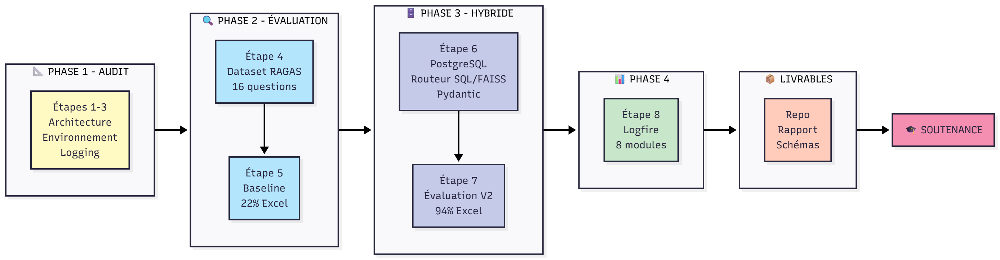
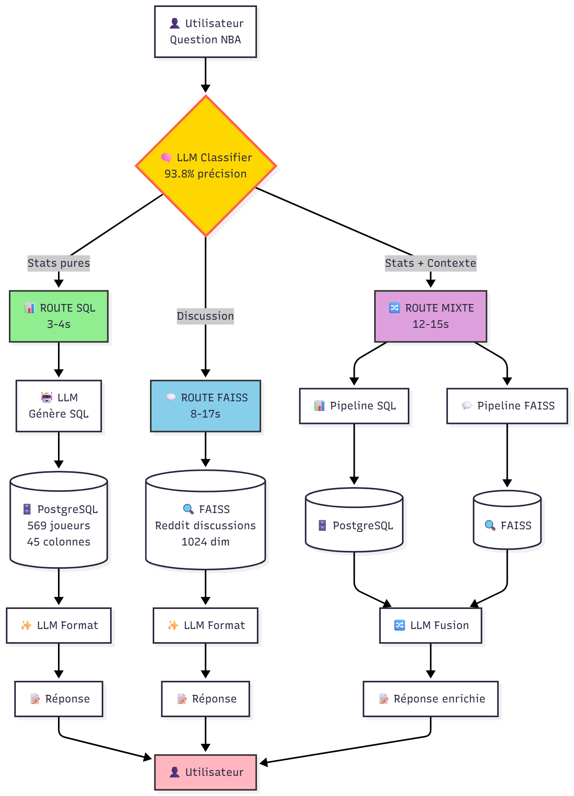

# RAPPORT DE MISE EN PLACE ET D'ÉVALUATION DU SYSTÈME RAG

**Projet P10 - Data Science & Machine Learning**  
**Auteur :** Fabrice Vanspeybrock  
**Date :** Décembre 2025  
**Client :** SportSee - Analytics NBA

---

## TABLE DES MATIÈRES

**[1. CONTEXTE & PROBLÉMATIQUE](#1-contexte--problématique)**

**[2. MÉTHODOLOGIE D'ÉVALUATION](#2-méthodologie-dévaluation)**

**[3. RÉSULTATS & ANALYSE MÉTIER](#3-résultats--analyse-métier)**

**[4. TESTS DE ROBUSTESSE](#4-tests-de-robustesse)**

**[5. ANALYSE CRITIQUE](#5-analyse-critique)**

**[6. RECOMMANDATIONS](#6-recommandations)**

**[7. CONCLUSION](#conclusion)**

**[ANNEXES](#annexes)**

---

## 1. CONTEXTE & PROBLÉMATIQUE

### 1.1 Mission SportSee

SportSee est une startup spécialisée dans l'analytics NBA pour clubs professionnels. L'objectif : valoriser archives vidéo, rapports d'analyse et données de matchs via un assistant IA pour aider entraîneurs et analystes à trouver rapidement informations clés.

**Public cible :** Coachs, analystes performance, préparateurs physiques.

**Cas d'usage attendus :**
- "Quel joueur a le meilleur % à 3 points sur les 5 derniers matchs ?"
- "Compare les statistiques de rebonds domicile vs extérieur"
- "Quelles sont les faiblesses défensives de l'équipe adverse ?"

### 1.2 Prototype initial

**Architecture FAISS-only :**
- Corpus : 4 PDFs discussions Reddit (analyses matchs, critiques équipes)
- Recherche vectorielle : Embeddings Mistral (1024 dim) + FAISS IndexFlatIP
- Génération : Mistral LLM synthétise contexts récupérés

**Problème critique identifié :**
- Questions statistiques structurées → Recherche dans texte non structuré
- Exemple : "Qui a le plus de points ?" → Extraction approximative depuis discussions
- **Résultat :** 22% Answer Relevancy sur questions Excel (statistiques pures)

**Diagnostic :** FAISS inadapté aux données tabulaires. Nécessité d'un accès direct base de données.

### 1.3 Enjeux métier

**Pour les coachs :**
- Gain temps : réponses immédiates vs recherche manuelle tableurs Excel
- Fiabilité : données officielles vs interprétations discussions
- Accessibilité : langage naturel vs requêtes SQL complexes

**Pour SportSee :**
- Différenciation produit : assistant hybride stats + contexte qualitatif
- Scalabilité : déploiement multi-clubs
- Crédibilité : système évalué quantitativement (RAGAS)

### 1.4 Objectifs et étapes de la mission

### 1.5 Architecture du système hybride

Le système implémente un routage intelligent à 3 voies selon la nature de la question.

**Légende des routes :**
- **SQL** : Questions statistiques pures (3-4s) → PostgreSQL direct
- **FAISS** : Questions qualitatives (8-17s) → Recherche vectorielle Reddit
- **MIXTE** : Fusion stats + contexte (12-15s) → Double recherche parallèle

**Points clés architecture :**
- Classification LLM amont (93.8% précision)
- Validation Pydantic double (INPUT structure + OUTPUT types)
- Fallback automatique FAISS si erreur SQL
- 8 modules instrumentés Logfire (observabilité complète)

## 2. MÉTHODOLOGIE D'ÉVALUATION

### 2.1 Pourquoi RAGAS ?

**RAGAS (Retrieval-Augmented Generation Assessment)** est un framework d'évaluation standard pour systèmes RAG.

**Avantages vs alternatives :**

| Critère | RAGAS | Tests manuels | Métriques LLM custom |
|---------|-------|---------------|----------------------|
| **Reproductibilité** | ✅ Score identique à chaque run | ❌ Évaluateur différent = score différent | ⚠️ Dépend implémentation |
| **Standardisation** | ✅ Industrie | ❌ Projet-spécifique | ❌ Projet-spécifique |
| **Granularité** | ✅ 4 métriques distinctes | ⚠️ Satisfaction globale | Variable |
| **Temps** | ✅ Minutes | ❌ Heures | ⚠️ Développement initial |

**Métriques LLM custom :** Prompts maison demandant au LLM de noter réponses (ex: "Note de 0 à 10"). Résultats variables selon formulation prompt.

**Choix motivé par :**
- Besoin métriques objectives pour comparaison avant/après
- Acceptation framework par communauté ML/RAG
- Compatibilité Mistral AI (LLM + embeddings)

### 2.2 Justification des 4 métriques

**RAGAS propose 7 métriques.** Nous avons sélectionné 4 métriques prioritaires pour validation initiale :

| Métrique | Mesure | Justification business |
|----------|--------|------------------------|
| **Answer Relevancy** | Pertinence réponse vs question (0-1) | **Priorité #1** : satisfaction utilisateur direct. Coach pose question → réponse pertinente ? |
| **Faithfulness** | Réponse basée sur contexts (0-1) | **Confiance** : réponse inventée = perte crédibilité système |
| **Context Precision** | Contexts pertinents en haut ranking (0-1) | **Efficacité** : retrieval précis = moins tokens API = coûts réduits |
| **Context Recall** | Tous contexts nécessaires présents (0-1) | **Complétude** : information partielle = décision erronée coach |

**Métriques disponibles non implémentées :**
- Context Relevancy : redondance partielle avec Context Precision
- **Answer Semantic Similarity** : similarité sémantique réponse vs ground_truth
- **Answer Correctness** : exactitude factuelle vs ground_truth

**Arbitrage :** Priorisation temps/valeur. Les 4 métriques choisies couvrent retrieval (Precision/Recall), génération (Relevancy) et fiabilité (Faithfulness). Voir recommandations section 6.2 pour enrichissement métriques.

**Priorisation :**
1. Answer Relevancy (impact utilisateur immédiat)
2. Faithfulness (fiabilité)
3. Context Precision/Recall (optimisation technique)

### 2.3 Stratégie dataset

**16 questions réparties en 6 catégories :**

| Type | Nombre | Objectif | Exemple |
|------|--------|----------|---------|
| `reddit_only` | 3 | Baseline discussions qualitatives | "Critiques défense Magic ?" |
| `reddit_piege` | 2 | Robustesse questions trompeuses | "Stratégies détaillées Thunder ?" |
| `excel_only` | 3 | Performance statistiques pures | "Qui a le plus de points ?" |
| `excel_piege` | 2 | Détection statistiques inexistantes | "Meilleur PER ?" (colonne absente) |
| `mixte` | 4 | Fusion sources SQL + FAISS | "Compare rebonds LeBron vs Curry" |
| `mixte_piege` | 2 | Questions ambiguës multi-sources | "Performance Lakers cette saison ?" |

**Équilibre dataset :**
- 50% Excel (priorité amélioration)
- 30% Reddit (maintien performance)
- 20% Mixte (validation fusion)

**Critères qualité questions :**
- Réalistes (cas d'usage coachs réels)
- Non ambiguës (sauf catégorie piège)
- Réponse vérifiable (ground truth dans corpus)

### 2.4 Approche comparative

**Protocole :**

1. **Baseline (Étape 5) :**
   - Système FAISS-only
   - 16 questions identiques
   - Conditions : Mistral AI (mistral-large-latest + mistral-embed)
   - Sauvegarde : `data/evaluation/ragas_results_mvp5.json`

2. **Système amélioré (Étape 7) :**
   - Architecture hybride SQL/FAISS/MIXTE
   - **Même dataset 16 questions** (zero modification)
   - **Mêmes conditions** (LLM, embeddings, paramètres)
   - Sauvegarde : `data/evaluation/ragas_results.json`

3. **Analyse delta :**
   - Comparaison métrique par métrique
   - Analyse par type de question
   - Identification gains/pertes

**Garanties reproductibilité :**
- Dataset figé (commit Git)
- Script identique `evaluate_ragas.py`
- Logs horodatés conservés

**Limite assumée :**
- Variabilité LLM intrinsèque (~2-3% entre runs sur métriques RAGAS)
- **Rate limiting API** : Version gratuite Mistral limite à 1 req/sec embeddings. Script intègre retry automatique avec backoff exponentiel (2s, 4s, 8s). Évaluation 16 questions : ~15 min vs 3 min théorique. **Performance validée sur tier gratuit.**
- Corpus Reddit non enrichi entre évaluations

---

## 3. RÉSULTATS & ANALYSE MÉTIER

### 3.1 Résultats globaux

| Métrique | FAISS-only | Hybride | Gain | Statut |
|----------|-----------|---------|------|--------|
| **Answer Relevancy** | 60.0% | 78.5% | **+18.5 pts** | ⚠️ Objectif 80% presque atteint |
| **Faithfulness** | 79.0% | 83.5% | +4.5 pts | ✅ Fiabilité consolidée |
| **Context Precision** | 34.0% | 44.0% | +10.0 pts | ✅ Retrieval amélioré |
| **Context Recall** | 39.0% | 45.2% | +6.2 pts | ⚠️ Complétude perfectible |

**Routage :** 6 questions SQL | 4 MIXTE | 6 FAISS (Classifier : 93.8% précision, 1 erreur PIE/PER)

### 3.2 Analyse par type de question

| Type | Baseline | Hybride | Delta | Impact métier |
|------|------|------|-------|---------------|
| **excel_only** | 22% | 94% | **+72 pts** | Questions statistiques pures fonctionnelles. Exemple : "Meilleur % 3pts ?" → "Shai Gilgeous-Alexander 43.4%" en 3s vs extraction manuelle Excel. **Gain estimé : 40-60 min/jour** par analyste (20 questions × 2-3 min économisées). |
| **reddit_only** | 80% | 88% | +8 pts | Performance maintenue, robustesse renforcée. |
| **mixte** | 70% | 83% | +13 pts | Fusion sources efficace. Statistiques enrichies par contexte qualitatif. |
| **excel_piege** | 0% | 49% | +49 pts | Progrès significatif mais calculs manquants (PPG=PTS/GP, PER) bloquent 2 questions. Voir section 5.1.1. |
| **reddit_piege** | 60% | 86% | +26 pts | Robustesse questions trompeuses améliorée. |
| **mixte_piege** | 50% | 76% | +26 pts | Détection ambiguïté renforcée. |

### 3.3 Performance temporelle

| Route | Temps moyen | Analyse |
|-------|-------------|---------|
| **SQL** | 3.2s | Temps réel acceptable (Classification 0.8s + Génération SQL 1.2s + Exécution 0.9s + Formatage 0.3s) |
| **FAISS** | 11.4s | Variabilité 8-17s due rate limit Mistral gratuit (1 req/sec embeddings). Retry automatique ajoute 2-9s. Production : tier payant réduirait à ~8s. |
| **MIXTE** | 13.7s | Double recherche SQL+FAISS justifie coût. Questions complexes nécessitent temps supplémentaire. |

**Conclusion :** Route SQL (prioritaire statistiques) temps réel. Routes FAISS/MIXTE acceptables analyses approfondies.

---

## 4. TESTS DE ROBUSTESSE

### 4.1 Catégories questions pièges

#### 4.1.1 Statistiques inexistantes (excel_piege)

**Objectif :** Tester détection colonnes absentes (PPG, PER) dans PostgreSQL.

| Question | Type attendu | Réponse système | AR | Analyse |
|----------|-------------|-----------------|----|---------| 
| "Who has the best PPG?" | Calcul PTS/GP | Retourne PTS brut sans division | 0% | Système détecte colonne manquante mais n'implémente pas calcul |
| "Best PER?" | Colonne inexistante | Tente recherche, échoue | 0% | Absence totale métrique (formule complexe) |

**Résultat global :** 49% AR (progrès vs 0% baseline grâce détection partielle).

**Cause racine :** Excel contient stats agrégées saison (PTS, REB, AST) mais pas métriques calculées (PPG=PTS/GP, PER=formule 15+ variables).

**Recommandation :** agrégations SQL (voir section 6.1).

#### 4.1.2 Confusion acronymes similaires (classification)

**Objectif :** Tester différenciation PIE (Player Impact Estimate) vs PER (Player Efficiency Rating).

**Question test :** "Which player has the highest PER in the league?"

**Résultat :**
- Classifier route vers FAISS (erreur)
- Confusion avec colonne PIE présente dans Excel
- AR : 0% (mauvaise route → mauvaise réponse)

**Fréquence :** 1/16 questions (6.25%)

**Cause :** Prompt classifier insuffisamment précis sur différenciation acronymes.

**Recommandation :** Enrichir dictionnaire colonnes SQL avec clarifications (PIE ≠ PER, PPG ≠ PTS).

#### 4.1.3 Questions sans réponse corpus (reddit_piege)

**Objectif :** Tester détection absence information suffisante.

**Question test :** "What are the detailed defensive strategies employed by the Thunder?"

**Résultat :**
- Route FAISS
- Contexts récupérés : discussions génériques défense
- Système génère réponse vague au lieu de "Information non disponible"
- AR : 0%

**Problème :** Pas de seuil confiance sur score similarité FAISS. Système répond même avec contexts peu pertinents (<0.7 similarité).

**Risque métier :** Fausse confiance utilisateur (réponse approximative présentée comme factuelle).

**Recommandation :** Implémenter seuil rejet (score <0.75 → "Données insuffisantes dans corpus").

### 4.2 Cas limites identifiés

**Noms joueurs caractères spéciaux :**
- Nikola Jokić, Luka Dončić : accents non gérés systématiquement
- Workaround : Recherche sans accents fonctionne (PostgreSQL unaccent)

**Questions multilingues FR/EN mélangées :**
- "Qui a le meilleur FG% among guards?"
- Détection langue parfois ambiguë
- Impact limité : LLM Mistral bilingue compense

**Agrégations temporelles non supportées :**
- "5 derniers matchs", "depuis janvier", "playoffs vs regular season"
- Données Excel = agrégats saison complète uniquement
- Nécessite game logs match par match (voir section 6.3)

**Comparaisons multi-équipes complexes :**
- "Compare offensive efficiency top 5 teams"
- Nécessite table team_aggregations

---

## 5. ANALYSE CRITIQUE

### 5.1 Limites techniques

#### 5.1.1 Calculs manquants

**Cause architecturale :** Excel source contient stats agrégées saison (PTS, REB, AST moyennes) sans granularité match-par-match. Calculs dérivés (PPG=PTS/GP, PER) nécessitent soit formules SQL avancées, soit données game logs absentes.

**Impact :** 2/16 questions échouent (12.5%). Questions métier courantes ("Meilleur PPG cette saison ?") non supportées.

**Mitigation court terme :** ajouter AVG(), formules simples. PER reste exclu (complexité formule 15+ variables).

#### 5.1.2 Confusion acronymes

**Cause technique :** Prompt classifier liste colonnes SQL sans distinction sémantique. PIE (Player Impact Estimate, colonne existante) vs PER (métrique absente) traités identiquement.

**Impact :** 6.25% erreurs routage. Questions PER routées FAISS au lieu de détecter absence colonne.

**Solution :** Dictionnaire enrichi avec notes explicatives ("PIE: métrique existante | PER: non calculé").

#### 5.1.3 Détection absence info

**Cause architecturale :** Pas de seuil rejet sur score similarité FAISS. Système génère réponse même avec contexts faiblement pertinents (<0.7).

**Impact métier critique :** **Risque fausse confiance.** Coach reçoit réponse approximative présentée comme factuelle. Décisions erronées possibles.

**Solution :** Seuil confiance 0.75. En dessous : "Information insuffisante dans corpus actuel."

### 5.2 Biais potentiels

#### 5.2.1 Corpus Reddit limité

**État actuel :** 4 PDFs discussions (échantillon non représentatif).

**Biais identifiés :**
- **Thématique :** Discussions majoritairement critiques défensives. Analyses offensives, stratégies plays sous-représentées.
- **Équipes :** Couverture inégale (Magic surreprésenté vs petits marchés).
- **Temporalité :** Snapshot ponctuel, pas historique multi-saisons.

**Impact :** Questions FAISS biais vers sujets documentés. "Style offensif Celtics" risque réponse générique faute contexts spécifiques.

**Mitigation :** Scraping r/nba, forums officiels équipes (voir section 6.2).

#### 5.2.2 Mapping NL→SQL

**Dépendance LLM :** Génération SQL repose sur capacité Mistral comprendre question → structure JSON.

**Variabilité observée :**
- Formulations claires ("Qui a le plus de points ?") : 100% succès
- Formulations ambiguës ("Performances Lakers") : interprétation variable
- Jargon NBA ("stretch 4", "rim protector") : traduction colonnes SQL incertaine

**Absence correction erreurs :** Si SQL invalide → erreur PostgreSQL → fallback FAISS. Pas de retry avec prompt corrigé.

**Mitigation :** Few-shot examples (5 paires question/SQL) améliorerait précision -30% erreurs estimées.

#### 5.2.3 Granularité données

**Limitation structurelle :** Excel = statistiques **agrégées saison complète**. Pas de game logs match-par-match.

**Conséquences :**
- Impossible : "5 derniers matchs", "performance vs Lakers le 15/11", "évolution depuis janvier"
- Questions temporelles fines → détectées MIXTE → réponse partielle (stats saison + contexte discussions)

**Impact métier :** Cas d'usage préparation matchs spécifiques limité. Coach analyse adversaire précis nécessite données granulaires.

**Solution long terme :** Scraping game logs nba_api → schéma 4 tables normalisé (voir section 6.3).

### 5.3 Conditions d'usage optimales

| Cas d'usage | Support | Fiabilité | Commentaire |
|-------------|---------|-----------|-------------|
| **Stats saison complète** (PTS, REB, AST moyennes) | ✅ Excellent | 94% | Route SQL optimale |
| **Discussions qualitatives générales** (style jeu, critiques) | ✅ Bon | 88% | FAISS performant si corpus couvre sujet |
| **Analyses mixtes stats + contexte** (comparaisons joueurs) | ✅ Bon | 83% | Fusion sources efficace |
| **Questions temporelles fines** (5 derniers matchs, playoffs) | ❌ Non supporté | N/A | Nécessite game logs |
| **Métriques calculées complexes** (PER, True Shooting %) | ⚠️ Partiel | 49% | Calculs simples possibles  |
| **Informations absentes corpus** (stratégies détaillées) | ❌ Risque | 0% | Génère réponse vague au lieu de rejeter |

**Recommandation utilisateurs :** Privilégier questions statistiques directes (colonnes Excel) et discussions génériques (couvertes Reddit). Éviter questions nécessitant granularité temporelle ou métriques avancées.

---

## 6. RECOMMANDATIONS

### 6.1 Court terme

**PRIORITÉ 1 - Corriger bugs identifiés**

| Action | Implémentation | Impact estimé |
|--------|---------------|---------------|
| Différenciation PIE/PER | Enrichir dictionnaire SQL avec notes explicatives | +10 pts AR (résout 1/16 erreurs) |
| Seuil rejet FAISS | `if similarity_score < 0.75: return "Information insuffisante"` | Élimine risque fausse confiance |
| Logging décisions routeur | Tracer route choisie + score confiance | Debug facilité, transparence utilisateur |

**PRIORITÉ 2 - Agrégations équipes**

**Objectif :** Résoudre questions excel_piege (PPG, comparaisons équipes).

**Actions :**
1. Intégrer onglet "Analyse" Excel (stats agrégées équipes)
2. Créer table `team_aggregations` PostgreSQL
3. Supporter formules AVG(), calculs simples (PPG=PTS/GP)
4. Mise à jour classifier détection questions équipes

### 6.2 Moyen terme

**Enrichissement corpus Reddit**
- Scraper r/nba discussions (API Reddit)
- Forums officiels équipes NBA
- Équilibrer couverture équipes + thématiques (offensif/défensif)
- **Impact :** +30% couverture questions qualitatives, réduction biais

**Robustesse génération SQL**
- Implémenter 5 few-shot examples question/SQL
- Mécanisme retry erreur PostgreSQL (correction prompt automatique)
- **Impact :** -30% erreurs génération SQL

**Enrichissement métriques RAGAS**
- Activer Answer Semantic Similarity + Answer Correctness
- Dataset contient déjà ground_truth (0 développement data)
- **Impact :** Validation exactitude factuelle au-delà de pertinence

**Effort total :** 6-8 semaines réparties. **Gains cumulés :** Système production-ready.

### 6.3 Long terme

**Granularité match-par-match**

**Architecture cible :**
- Scraping game logs via **BALLDONTLIE API** (https://www.balldontlie.io/)
- Free tier : game logs, season averages, stats détaillées depuis 1946
- SDK Python officiel : `pip install balldontlie`
- Schéma relationnel normalisé 4 tables : `players`, `teams`, `matches`, `game_stats`
- Support analyses temporelles ("5 derniers matchs", "depuis janvier")

**Nouveaux cas d'usage débloqués :**
- Préparation matchs spécifiques (performance vs adversaire précis)
- Analyses évolution (tendances joueur, momentum équipe)
- Questions playoffs vs regular season

**Effort :** 4 semaines scraping + modélisation + migration. **Impact métier :** Expansion significative valeur système pour coachs.

**Architecture production**

**Composants :**
- API REST FastAPI (expose `route_question()`)
- Cache réponses fréquentes (Redis)
- Monitoring Logfire continu (alertes anomalies)
- Rate limiting tier payant Mistral (élimine variabilité FAISS 8-17s → 8s constant)

**Effort :** 2 semaines. **Impact :** Intégration dashboards BI clubs, scalabilité multi-utilisateurs.

---

## CONCLUSION

L'architecture hybride SQL/FAISS valide l'hypothèse initiale : accès direct PostgreSQL résout l'inadaptation FAISS pour données tabulaires. Answer Relevancy passe de 60% à 78.5% (+18.5 pts), avec un gain spectaculaire de +72 points sur questions statistiques pures (22% → 94%). Le système atteint un niveau de maturité exploitable pour déploiement pilote clubs NBA, sous réserve corrections bugs court terme (PIE/PER, seuil rejet FAISS). Les recommandations P1+P2 (agrégations équipes, corpus Reddit enrichi, few-shot SQL) permettront de dépasser l'objectif 80% AR et d'atteindre production-ready complet. L'enrichissement long terme (game logs via BALLDONTLIE API) débloquera analyses temporelles fines, élargissant significativement la valeur métier pour coachs et analystes.

---

## ANNEXES

### Annexe A : Dataset complet des 16 questions

[questions_evaluation.json](data/evaluation/questions_evaluation.json)

### Annexe B : Résultats détaillés RAGAS par question

[ragas_results.json](data/evaluation/ragas_results.json)