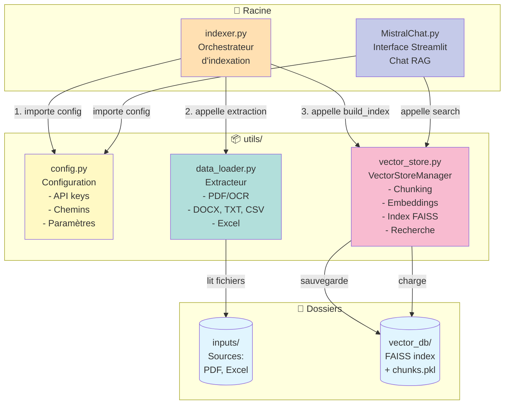

# NBA Analyst AI - Système RAG

Assistant conversationnel intelligent pour l'analyse de performances NBA. Le système utilise une architecture RAG (Retrieval-Augmented Generation) combinant recherche vectorielle FAISS et modèle de langage Mistral AI pour répondre aux questions sur les matchs et statistiques de basketball.

---

## 📋 Table des matières

- [Prérequis](#-prérequis)
- [Installation](#-installation)
- [Configuration](#️-configuration)
- [Utilisation](#-utilisation)
- [Architecture](#-architecture)
- [Structure du projet](#-structure-du-projet)
- [Roadmap](#-roadmap)

---

## 🔧 Prérequis

- **Python 3.12**
- **uv** (gestionnaire de paquets) : [Installation uv](https://github.com/astral-sh/uv)
- **Compte Mistral AI** avec clé API : [Mistral AI](https://console.mistral.ai/home)
- **EasyOCR** pour l'extraction de texte depuis PDF

---

## 📦 Installation
```bash
# Cloner le repository
git clone https://github.com/FabParis20/P10_SportSee_RAG.git
cd P10_SportSee_RAG

# Initialiser l'environnement avec uv
uv sync

# Vérifier l'installation
uv run python --version  # Doit afficher Python 3.12.x
```

---

## ⚙️ Configuration

Créez un fichier `.env` à la racine du projet :
```env
MISTRAL_API_KEY=votre_clé_api_mistral_ici
```

**Note** : Le fichier `.env` est ignoré par Git pour protéger vos credentials.

---

## 🚀 Utilisation

### Étape 1 : Indexation des documents

Cette étape n'est à faire **qu'une seule fois** (ou lors de l'ajout de nouveaux documents) :
```bash
uv run python indexer.py
```

Cela va :
- Extraire le texte des PDF dans `inputs/` (via OCR)
- Découper le contenu en chunks de 1500 caractères
- Générer les embeddings avec Mistral
- Créer l'index vectoriel FAISS dans `vector_db/`

### Étape 2 : Lancer l'interface chat
```bash
uv run streamlit run MistralChat.py
```

L'interface Streamlit s'ouvrira dans votre navigateur (généralement `http://localhost:8501`).

---

## 📐 Architecture

### Schéma 1 : Architecture des modules



### Schéma 2 : Flux de données

```mermaid
graph LR
    subgraph "📐 PHASE 1 - AUDIT"
        MVP1[MVP1<br/>Compréhension<br/>Schéma UML actuel<br/>Inventaire fichiers]
        MVP2[MVP2<br/>Stabilisation<br/>Requirements.txt<br/>README install]
        MVP3[MVP3<br/>Audit fonctionnel<br/>Tests scripts<br/>Logging]
    end
    
    subgraph "🔍 PHASE 2 - ÉVALUATION V1"
        MVP4[MVP4<br/>Setup RAGAS<br/>Dataset questions<br/>Script eval]
        MVP5[MVP5<br/>Analyse RAGAS<br/>Interpréter scores<br/>Tableau synthèse]
    end
    
    subgraph "🗄️ PHASE 3 - ENRICHISSEMENT SQL"
        MVP6[MVP6<br/>Design SQL<br/>Schéma relationnel<br/>Ingestion Excel]
        MVP7[MVP7<br/>Tool SQL<br/>sql_tool.py<br/>Intégration agent]
    end
    
    subgraph "📊 PHASE 4 - VALIDATION"
        MVP8[MVP8<br/>Évaluation finale<br/>RAGAS V2<br/>Comparaison avant/après]
    end
    
    subgraph "📦 LIVRABLES"
        FINAL[Repo Git structuré<br/>3 schémas UML<br/>Rapport RAG<br/>Scripts documentés]
    end
    
    MVP1 --> MVP2
    MVP2 --> MVP3
    MVP3 --> MVP4
    MVP4 --> MVP5
    MVP5 --> MVP6
    MVP6 --> MVP7
    MVP7 --> MVP8
    MVP8 --> FINAL
    
    FINAL --> SOUT[🎓 SOUTENANCE]
    
    style MVP1 fill:#fff9c4
    style MVP2 fill:#fff9c4
    style MVP3 fill:#fff9c4
    style MVP4 fill:#b3e5fc
    style MVP5 fill:#b3e5fc
    style MVP6 fill:#c5cae9
    style MVP7 fill:#c5cae9
    style MVP8 fill:#c8e6c9
    style FINAL fill:#ffccbc
    style SOUT fill:#f48fb1
```




### Description des composants

| Composant | Rôle |
|-----------|------|
| **MistralChat.py** | Interface utilisateur Streamlit pour poser des questions |
| **indexer.py** | Orchestrateur d'indexation : coordonne extraction → embedding → stockage |
| **config.py** | Configuration centralisée (API keys, chemins, paramètres) |
| **data_loader.py** | Extraction de texte multi-format (PDF, DOCX, Excel, CSV, TXT) |
| **vector_store.py** | Gestionnaire de l'index vectoriel FAISS et recherche sémantique |

---

## 📁 Structure du projet
```
P10_DSML/
├── MistralChat.py          # Interface Streamlit
├── indexer.py              # Orchestrateur indexation
├── requirements.txt        # Dépendances Python
├── pyproject.toml          # Configuration uv
├── .env                    # Variables d'environnement (non versionné)
├── inputs/                 # Sources de données
│   ├── Reddit 1.pdf à 4.pdf   # Commentaires matchs NBA
│   └── regular NBA.xlsx       # Statistiques joueurs
├── vector_db/              # Index vectoriel FAISS
│   ├── faiss_index.idx        # Index FAISS
│   └── document_chunks.pkl    # Chunks sérialisés
└── utils/                  # Modules utilitaires
    ├── config.py
    ├── data_loader.py
    └── vector_store.py
```

---

## 🚧 Roadmap

- [x] **MVP1** : Architecture de base + indexation PDF Reddit
- [ ] **MVP2** : Stabilisation environnement (tests, logging)
- [ ] **MVP3** : Audit fonctionnel
- [ ] **MVP4-5** : Évaluation RAGAS
- [ ] **MVP6-7** : Intégration base SQL + données Excel
- [ ] **MVP8** : Évaluation finale + rapport comparatif

---

**Auteur** : Fabrice - Projet P10 Data Science & Machine Learning  
**Date** : Novembre 2025