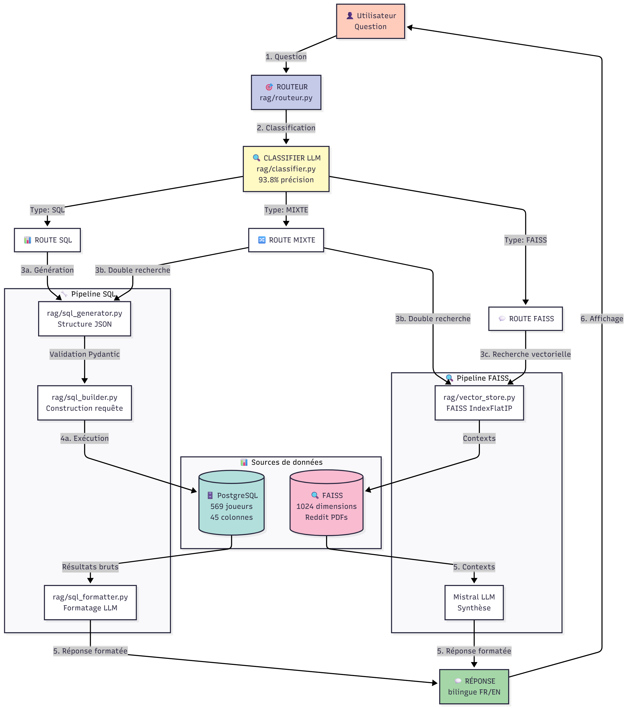
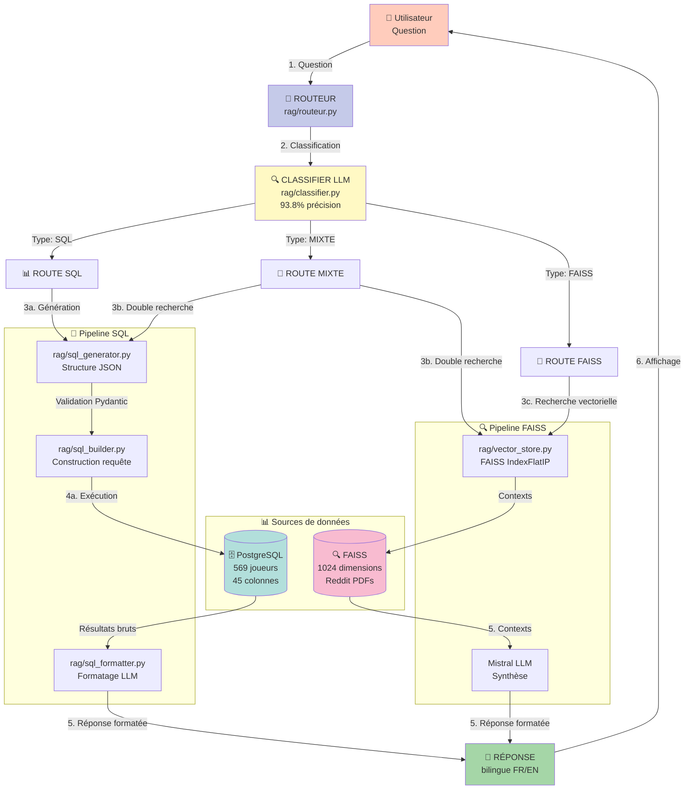

# 🏀 NBA RAG - Assistant IA SportSee

Assistant conversationnel intelligent combinant **recherche vectorielle** et **base de données SQL** pour répondre aux questions sur les statistiques NBA et les discussions de matchs. Architecture hybride avec routage intelligent vers la source de données appropriée.

---

## ⚡ QUICK START

**Temps estimé :**
- Avec Python, uv, PostgreSQL déjà installés : **5 minutes**
- Installation complète depuis zéro : **15-20 minutes**

**Vous n'êtes pas technique ? Pas de problème. Voici comment tester l'assistant en 5 étapes :**

### 1️⃣ Installer Python 3.12

**Windows :**
- Téléchargez **Python 3.12.x** → [Lien direct Python 3.12.7](https://www.python.org/downloads/release/python-3127/)
- Cliquez sur "Windows installer (64-bit)" en bas de la page
- ⚠️ **IMPORTANT** : Cochez "Add Python to PATH" avant d'installer

**Mac :**
```bash
brew install python@3.12
```

**Linux :**
```bash
sudo apt update && sudo apt install python3.12
```
> ⚠️ **Note importante :** Ce projet nécessite Python **3.12.x spécifiquement**.  
> Ne pas installer Python 3.13+ ou 3.11-, cela causera des incompatibilités.

Vérifiez l'installation :
```bash
python --version  # Doit afficher Python 3.12.x
```

---

### 2️⃣ Installer uv (gestionnaire de paquets)

**Windows :**
```powershell
powershell -c "irm https://astral.sh/uv/install.ps1 | iex"
```

**Mac / Linux :**
```bash
curl -LsSf https://astral.sh/uv/install.sh | sh
```

Vérifiez :
```bash
uv --version
```

---

### 3️⃣ Télécharger le projet

**Option A - Avec Git :**
```bash
git clone https://github.com/FabParis20/P10_SportSee_RAG.git
cd P10_SportSee_RAG
```

**Option B - Téléchargement direct :**
1. Téléchargez → [P10_SportSee_RAG.zip](https://github.com/FabParis20/P10_SportSee_RAG/archive/refs/heads/main.zip)
2. Décompressez le fichier
3. Ouvrez un terminal dans le dossier :
   - Windows : Tapez `cmd` dans la barre d'adresse du dossier et appuyez sur Entrée
   - Mac : Glissez-déposez le dossier sur l'icône Terminal
   - Linux : Clic droit → "Ouvrir dans le terminal"

---

### 4️⃣ Configurer les variables d'environnement

Copiez le fichier modèle `.env.example` et remplissez vos credentials :
```bash
cp .env.example .env
```

**Comment obtenir une clé API Mistral ?**
1. Allez sur [console.mistral.ai](https://console.mistral.ai/)
2. Créez un compte (gratuit)
3. Section "API Keys" → "Create new key"
4. Copiez la clé dans votre `.env`
---

### 5️⃣ Installer les dépendances
```bash
uv sync  # Installe les dépendances (~1 minute)
```
---
### 6️⃣ Initialiser les bases de données

**PostgreSQL (statistiques NBA) :**

Installez PostgreSQL 17 : [Télécharger ici](https://www.postgresql.org/download/)

Créez la base de données :
```bash
# Ouvrez psql (terminal PostgreSQL)
# À l'installation, vous avez défini un mot de passe pour l'utilisateur 'postgres'
psql -U postgres
CREATE DATABASE nba_stats;
\q
```

**Configurez PostgreSQL dans `.env` :**
```env
POSTGRES_PASSWORD=votre_mot_de_passe_postgres
```

Chargez les données :
```bash
uv run python scripts/load_excel_to_db.py
```
💡 Temps : ~30 secondes | 569 joueurs + 30 équipes insérés

**FAISS (discussions Reddit) :**
```bash
uv run python scripts/indexer.py
```
💡 Temps : ~2 minutes | Chunking + embeddings + index vectoriel

---

### 7️⃣ Lancer l'assistant

**Dans le terminal, tapez ces 2 commandes :**
```bash
uv run streamlit run MistralChat.py  # Lance l'interface
```

**✅ Une page web s'ouvre automatiquement dans votre navigateur !**

**🎉 Posez votre première question**

---

## 🎯 VUE D'ENSEMBLE

SportSee assistant IA pour analyse NBA. Répond aux questions des coachs sur statistiques et matchs.

**Problème initial :** Le prototype utilisait uniquement FAISS (recherche vectorielle) sur des discussions Reddit. 
❌ Inadapté aux questions statistiques : "Qui a le meilleur % à 3 points ?" → 22% de pertinence.

**Solution développée :** Architecture hybride avec routage intelligent :
- Questions statistiques → PostgreSQL (569 joueurs, 45 stats)
- Questions qualitatives → FAISS (discussions Reddit)
- Questions mixtes → Fusion des deux sources

**Impact métier :** Coachs peuvent maintenant poser des questions précises sur performances chiffrées.

---

## 🏗️ ARCHITECTURE

### Schéma global



<details>
<summary>📋 Code Mermaid (cliquez pour déplier)</summary>


💡 **Visualisation interactive :** Copiez le code ci-dessus dans [mermaid.live](https://mermaid.live/)

</details>

### Les 3 routes intelligentes

**🔵 Route SQL** (questions statistiques pures)
- Détecte : "Qui a le meilleur % à 3 points ?", "Top 5 rebondeurs"
- Pipeline : Question → Génération JSON → Validation Pydantic → Construction SQL → PostgreSQL → Formatage LLM
- Temps : 3-4 secondes

**🟣 Route MIXTE** (fusion données structurées + discussions)
- Détecte : "Compare les rebonds de LeBron et Curry", "Performance défensive Lakers cette saison"
- Pipeline : Question → Double recherche (SQL + FAISS) → Fusion contexts → LLM synthèse
- Temps : 12-15 secondes

**🟢 Route FAISS** (discussions qualitatives)
- Détecte : "Quelles critiques sur la défense des Magic ?", "Style de jeu des Celtics"
- Pipeline : Question → Embeddings → Recherche similarité → Contexts → LLM synthèse
- Temps : 8-17 secondes


### Stack technique

| Composant | Technologie | Rôle |
|-----------|-------------|------|
| **LLM** | Mistral AI (mistral-large-latest) | Classification, génération SQL, formatage |
| **Embeddings** | Mistral Embed (1024 dim) | Vectorisation questions/documents |
| **Vector DB** | FAISS IndexFlatIP | Recherche similarité cosinus |
| **SQL DB** | PostgreSQL 17 | Stockage statistiques NBA |
| **Validation** | Pydantic | Validation INPUT SQL (sécurité) |
| **Interface** | Streamlit | Chat conversationnel |
| **Observabilité** | Pydantic Logfire | Traçabilité end-to-end |

---

## 📊 RÉSULTATS CLÉS

**Amélioration significative de la précision du système RAG grâce à l'architecture hybride SQL/FAISS :**

| Métrique | Avant (FAISS seul) | Après (Hybride) | Gain |
|----------|-------------------|-----------------|------|
| **Answer Relevancy** | 60.0% | 78.5% | **+18.5 pts** |
| Questions Excel (stats) | 22.0% | 94.0% | **+72 pts** |
| Faithfulness | 79.0% | 83.5% | +4.5 pts |
| Context Precision | 34.0% | 44.0% | +10.0 pts |

**Architecture :**
- 🎯 Routage intelligent avec **93.8% de précision** (classifier LLM)
- 📊 **569 joueurs NBA** sur la saison 2024-25 (45 colonnes statistiques)
- 🔍 **1024 dimensions** pour la recherche vectorielle FAISS
- ✅ Validation Pydantic sur les entrées SQL
- 📈 Observabilité complète via Pydantic Logfire

**➡️ Le système répond maintenant correctement aux questions statistiques complexes comme "Qui a le meilleur pourcentage à 3 points chez les Lakers ?" en interrogeant directement PostgreSQL au lieu de chercher dans des discussions textuelles.**

---

## 📁 STRUCTURE PROJET

```
P10_DSML/
├── MistralChat.py              # 🎨 Interface Streamlit principale
│
├── rag/                        # 🧠 Modules métier (business logic)
│   ├── classifier.py           # Classification SQL/FAISS/MIXTE
│   ├── routeur.py              # Orchestration intelligente 3 routes
│   ├── sql_generator.py        # Génération structure JSON SQL
│   ├── sql_builder.py          # Construction requête SQL sécurisée
│   ├── sql_executor.py         # Exécution PostgreSQL
│   ├── sql_formatter.py        # Formatage LLM bilingue
│   └── vector_store.py         # Manager FAISS (search, embeddings)
│
├── schemas/                    # 📋 Modèles Pydantic
│   └── sql_models.py           # Validation INPUT SQL (SQLQueryInput)
│
├── scripts/                    # 🔧 Utilitaires autonomes
│   ├── indexer.py              # Chunking + embeddings + FAISS
│   ├── load_excel_to_db.py     # Ingestion Excel → PostgreSQL
│   └── evaluate_ragas.py       # Évaluation RAGAS
│
├── data/
│   ├── raw/                    # 📂 Sources originales
│   │   ├── *.pdf               # Discussions Reddit (4 PDFs)
│   │   └── *.xlsx              # Statistiques NBA 2024-25
│   ├── processed/              # 🔄 Données traitées
│   │   ├── faiss_index/        # Index FAISS + chunks.pkl
│   │   └── dict_clean.csv      # Dictionnaire colonnes SQL
│   ├── config/                 # ⚙️ Configuration
│   └── evaluation/             # 📊 Dataset + résultats RAGAS
│       ├── questions_evaluation.json  # 16 questions (6 types)
│       └── ragas_results.json         # Résultats MVP7
│
├── utils/                      # 🛠️ Modules transverses
│   ├── config.py               # Configuration centralisée
│   └── logger.py               # Logging structuré
│
├── docs/                       # 📖 Documentation
│   └── architecture/           # Schémas Mermaid
│
├── .env                        # 🔐 Secrets (API keys)
├── pyproject.toml              # 📦 Dépendances uv
└── README.md                   # 📘 Ce fichier
```

**Navigation rapide :**
- **Lancer interface** : `MistralChat.py`
- **Comprendre routage** : `rag/routeur.py` (point d'entrée principal)
- **Voir validation** : `schemas/sql_models.py`
- **Lancer évaluation** : `scripts/evaluate_ragas.py`

---


## 🧪 ÉVALUATION

### Lancer l'évaluation RAGAS

```bash
# Évaluation complète (16 questions)
uv run python scripts/evaluate_ragas.py

# Résultats sauvegardés automatiquement
data/evaluation/ragas_results.json
```

### Dataset d'évaluation

**16 questions réparties en 6 types :**
- `reddit_only` (3) : discussions qualitatives pures
- `reddit_piege` (2) : questions trompeuses sur discussions
- `excel_only` (3) : statistiques pures
- `excel_piege` (2) : statistiques inexistantes (PPG, PER)
- `mixte` (4) : combinaison stats + contexte
- `mixte_piege` (2) : questions ambiguës

**Voir détails :** `data/evaluation/questions_evaluation.json`

### Métriques RAGAS mesurées

| Métrique | Description |
|----------|-------------|
| **Answer Relevancy** | Pertinence de la réponse vs question (0-1) |
| **Faithfulness** | Réponse basée sur contexts fournis (0-1) |
| **Context Precision** | Contexts pertinents en haut du ranking (0-1) |
| **Context Recall** | Tous contexts nécessaires présents (0-1) |

**➡️ Analyse détaillée des résultats, graphiques et interprétation métier : voir `RAPPORT.pdf`**

---

## 🔍 OBSERVABILITÉ

### Dashboard Pydantic Logfire

**URL :** https://logfire-eu.pydantic.dev/fabparis20/p10

**Fonctionnalités :**
- 📊 Visualisation hiérarchique end-to-end de chaque question
- ⏱️ Temps d'exécution par module (classifier, SQL, FAISS, etc.)
- 🐛 Traçage des erreurs avec stack traces
- 📈 Statistiques d'utilisation (nombre de questions, routes empruntées)

💡 **Accès dashboard :** Disponible sur demande (accès viewer lecture seule)

**Modules instrumentés (8) :**
- `MistralChat.py` (contexte manuel)
- `rag/routeur.py` (décorateur @logfire.instrument)
- `rag/classifier.py`
- `rag/sql_generator.py`
- `rag/sql_builder.py`
- `rag/sql_executor.py`
- `rag/sql_formatter.py`
- `rag/vector_store.py`

### Logs structurés

**Fichiers logs :** `logs/app.log`

**Format :** `[timestamp] [level] [module] message`

**Exemple :**
```
2025-12-05 10:23:15 INFO classifier Question classifiée: SQL
2025-12-05 10:23:16 INFO sql_generator Structure JSON générée
2025-12-05 10:23:16 INFO sql_executor Requête SQL exécutée: 0.8s
```

---


**Auteur :** Fabrice Vanspeybrock - Projet P10 Data Science & Machine Learning  
**Date :** Décembre 2025  

