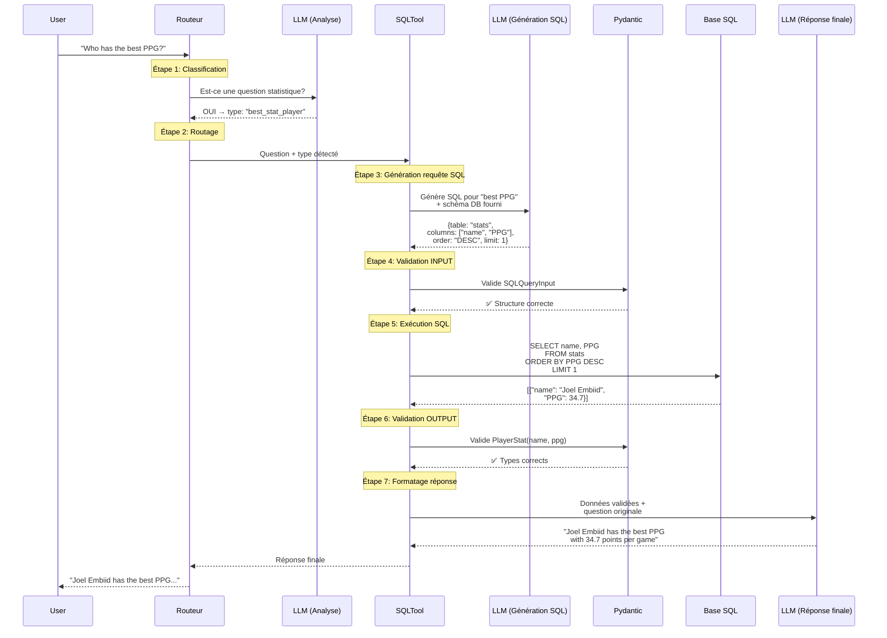

# Schéma Flux SQL Tool MVP6 - LLM, Pydantic, SQL

## Vue d'ensemble du flux complet



---

## Détail des 3 rôles du LLM

### **LLM #1 - Analyse de la question**
**Rôle :** Classifier le type de question  
**Input :** Question utilisateur  
**Output :** Type de question (ex: "best_stat_player", "single_stat_value", "compare_players")  
**Exemple :**
- Question: "Who has the best PPG?"
- Output: `{"query_type": "best_stat_player", "stat": "PPG"}`

---

### **LLM #2 - Génération requête SQL**
**Rôle :** Créer la requête SQL structurée  
**Input :** Question + schéma base de données + type détecté  
**Output :** Dictionnaire pour construire la requête SQL  
**Exemple :**
```json
{
  "table_name": "player_stats",
  "columns": ["player_name", "PPG"],
  "conditions": {},
  "order_by": {"column": "PPG", "direction": "DESC"},
  "limit": 1
}
```

---

### **LLM #3 - Formatage réponse finale**
**Rôle :** Transformer les données SQL en réponse en langage naturel  
**Input :** Résultats SQL validés + question originale  
**Output :** Phrase en langage naturel  
**Exemple :**
- Données: `{"player_name": "Joel Embiid", "PPG": 34.7}`
- Output: "Joel Embiid has the best PPG with 34.7 points per game."

---

## Les 2 validations Pydantic

### **Validation #1 - INPUT (avant exécution SQL)**

```python
class SQLQueryInput(BaseModel):
    table_name: str
    columns: List[str]
    conditions: Optional[Dict[str, Any]] = None
    order_by: Optional[Dict[str, str]] = None
    limit: Optional[int] = None
```

**Objectif :** S'assurer que le LLM #2 a bien généré une structure SQL valide

---

### **Validation #2 - OUTPUT (après exécution SQL)**

```python
class PlayerStat(BaseModel):
    player_name: str
    PPG: float

class SingleStatValue(BaseModel):
    value: float

class PlayerComparison(BaseModel):
    player1: PlayerStat
    player2: PlayerStat
```

**Objectif :** S'assurer que les résultats SQL correspondent au type attendu

---

## Flux simplifié par question type

### Question 1: "Who has the best PPG?"
1. **Routeur** → Détecte "statistique" → Envoie à SQLTool
2. **LLM #1** → Classifie: `best_stat_player`
3. **LLM #2** → Génère: `SELECT name, PPG ORDER BY PPG DESC LIMIT 1`
4. **Pydantic INPUT** → Valide structure requête ✅
5. **SQL DB** → Exécute et retourne: `{"name": "Joel Embiid", "PPG": 34.7}`
6. **Pydantic OUTPUT** → Valide `PlayerStat` ✅
7. **LLM #3** → Formate: "Joel Embiid has the best PPG with 34.7 points per game"

---

### Question 2: "What is the FT% of LeBron James?"
1. **Routeur** → Détecte "statistique" → Envoie à SQLTool
2. **LLM #1** → Classifie: `single_stat_value`
3. **LLM #2** → Génère: `SELECT FT_PCT WHERE name='LeBron James'`
4. **Pydantic INPUT** → Valide structure requête ✅
5. **SQL DB** → Exécute et retourne: `{"FT_PCT": 0.752}`
6. **Pydantic OUTPUT** → Valide `SingleStatValue(value=0.752)` ✅
7. **LLM #3** → Formate: "LeBron James has a free throw percentage of 75.2%"

---

## Points clés pour éviter les confusions

### ⚠️ **NE PAS CONFONDRE**

❌ **Le LLM ne génère PAS directement du SQL en texte brut**  
✅ **Le LLM génère une STRUCTURE (dict/JSON) que Pydantic valide, PUIS on construit le SQL**

❌ **Pydantic ne valide PAS le SQL lui-même**  
✅ **Pydantic valide la STRUCTURE avant SQL (INPUT) et les RÉSULTATS après SQL (OUTPUT)**

❌ **Il n'y a PAS qu'un seul appel LLM**  
✅ **Il y a 3 appels LLM distincts : classification → génération SQL → formatage réponse**

---

## Résumé du rôle de chaque composant

| Composant | Rôle | Moment d'intervention |
|-----------|------|----------------------|
| **Routeur** | Décide FAISS ou SQL | Tout début |
| **LLM #1** | Classifie le type de question | Après routage vers SQL |
| **LLM #2** | Génère structure pour SQL | Avant validation INPUT |
| **Pydantic INPUT** | Valide structure requête | Avant exécution SQL |
| **SQL DB** | Exécute la requête | Après validation INPUT |
| **Pydantic OUTPUT** | Valide résultats SQL | Après exécution SQL |
| **LLM #3** | Formate réponse finale | Après validation OUTPUT |

---

## Analogie pour comprendre

**C'est comme commander au restaurant :**

1. **Routeur** = Le serveur qui t'oriente vers la bonne section du menu (Plats / Desserts)
2. **LLM #1** = Tu choisis le TYPE de plat (Pizza / Pasta / Salade)
3. **LLM #2** = Tu donnes les DÉTAILS de ta commande (4 fromages, sans olives, pâte fine)
4. **Pydantic INPUT** = Le serveur VÉRIFIE que ta commande est complète et cohérente
5. **SQL DB** = La cuisine PRÉPARE ton plat
6. **Pydantic OUTPUT** = Le serveur VÉRIFIE que le plat correspond à ta commande
7. **LLM #3** = Le serveur te PRÉSENTE le plat de manière agréable

Sans Pydantic = Tu risques de recevoir une pizza avec des ingrédients manquants ou un dessert alors que tu as commandé un plat !
