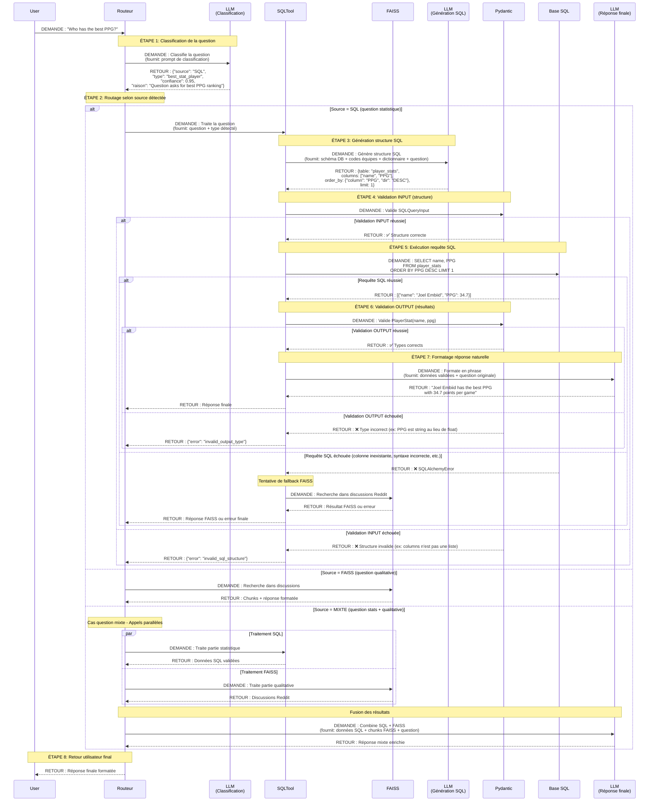

# Schéma Flux SQL Tool MVP6 - Version 3 (Finale)
**LLM, Pydantic, SQL - Gestion complète avec erreurs et questions mixtes**

---

## Vue d'ensemble du flux complet



---

## Prompt de classification (LLM Classification)

```python
classification_prompt = f"""
Tu es un classificateur de questions pour un système RAG sur le basketball NBA.

SOURCES DISPONIBLES :

1. BASE SQL : Statistiques chiffrées des joueurs
   
   COLONNES DISPONIBLES (dictionnaire des données) :
   {dictionnaire_donnees}
   
   Exemple de colonnes :
   - Player : Nom du joueur
   - Team : Équipe du joueur (code à 3 lettres)
   - Age : Âge du joueur
   - GP : Nombre de matchs joués (Games Played)
   - PPG : Points per game (points par match)
   - FT% : Free throw percentage (pourcentage lancers francs)
   - W : Nombre de victoires
   - L : Nombre de défaites
   [... liste complète des 76 colonnes statistiques ...]

   CODES ÉQUIPES :
   {table_codes_equipes}
   
   Exemple de codes :
   - ATL : Atlanta Hawks
   - BKN : Brooklyn Nets
   - BOS : Boston Celtics
   - LAL : Los Angeles Lakers
   - CHI : Chicago Bulls
   [... liste complète des 30 équipes NBA ...]

2. BASE FAISS : Discussions Reddit (opinions, analyses, commentaires de fans)

QUESTION UTILISATEUR : "{question_utilisateur}"

CONSIGNE :
Analyse cette question et réponds UNIQUEMENT par un JSON valide :

{{
  "source": "SQL" ou "FAISS" ou "MIXTE",
  "type": "best_stat_player" ou "single_stat_value" ou "compare_players" ou "qualitative_analysis" ou "mixed_analysis",
  "confiance": 0.0 à 1.0,
  "raison": "explication courte de ta décision"
}}

INDICATEURS pour source = "SQL" :
- Mots-clés statistiques : "best", "top", "highest", "lowest", "average", "percentage", "stats", "numbers", "rank", "compare", "#1", "leader"
- Demande de comparaison chiffrée entre joueurs/équipes
- Demande de classement/ranking
- Nom de statistique explicite (PPG, FT%, rebounds, assists, etc.)
- Questions avec "who has", "what is the", "which player", "how many"
- Demande de records, de performances chiffrées

INDICATEURS pour source = "FAISS" :
- Mots-clés qualitatifs : "opinion", "criticism", "critique", "strategy", "analysis", "narrative", "storyline", "fans think", "analysts say", "consensus"
- Demande d'explication qualitative, de contexte, d'analyse tactique
- Questions "why", "how come", "what do people think", "what's the perception"
- Références à des débats, controverses, discussions, polémiques
- Demande d'interprétation, de ressenti, d'ambiance

INDICATEURS pour source = "MIXTE" :
- Question combine STATS ET analyse qualitative
- Exemple : "What is the narrative about underdog teams this season" (stats des underdogs + discussions fans)
- Demande d'enrichissement des stats par du contexte narratif
- Question demande à la fois des chiffres ET leur interprétation

RÈGLES IMPORTANTES :

1. Si une statistique demandée n'existe PAS dans le dictionnaire des données ci-dessus :
   → Indique "source": "FAISS" 
   → "raison": "stat_not_available_in_sql - [nom_stat] column does not exist"

2. Si un code d'équipe est utilisé (ex: "LAL", "BOS") ou un nom d'équipe (ex: "Lakers", "Celtics") :
   → Vérifie s'il existe dans la table des codes équipes
   → Utilise le code à 3 lettres dans ta classification

3. Score de confiance :
   - 0.90-1.00 : Question très claire, un seul type possible
   - 0.70-0.89 : Question assez claire, forte probabilité
   - 0.50-0.69 : Question ambiguë, incertitude modérée
   - 0.00-0.49 : Question très ambiguë, faible certitude

4. La "raison" doit expliquer quel(s) indicateur(s) ont guidé ta décision
"""
```

---

## Exemple de flux pour question SQL simple

### Question : "Who has the best PPG?"

**ÉTAPE 1 - Classification :**
```json
{
  "source": "SQL",
  "type": "best_stat_player",
  "confiance": 0.95,
  "raison": "Question asks for 'best PPG' which is a statistical ranking. PPG column exists in database."
}
```

**ÉTAPE 2 - Routage :**
Le Routeur envoie vers SQLTool avec `type: "best_stat_player"`

**ÉTAPE 3 - Génération SQL :**
LLM (Génération SQL) reçoit :
- Question originale
- Schéma DB complet
- Dictionnaire des données
- Type détecté : "best_stat_player"

LLM génère :
```json
{
  "table_name": "player_stats",
  "columns": ["player_name", "PPG"],
  "conditions": {},
  "order_by": {"column": "PPG", "direction": "DESC"},
  "limit": 1
}
```

**ÉTAPE 4 - Validation INPUT :**
```python
class SQLQueryInput(BaseModel):
    table_name: str
    columns: List[str]
    conditions: Optional[Dict[str, Any]] = None
    order_by: Optional[Dict[str, str]] = None
    limit: Optional[int] = None

# Validation
query_input = SQLQueryInput(**llm_response)  # ✅ Succès
```

**ÉTAPE 5 - Exécution SQL :**
```sql
SELECT player_name, PPG 
FROM player_stats 
ORDER BY PPG DESC 
LIMIT 1
```

Résultat : `[{"player_name": "Joel Embiid", "PPG": 34.7}]`

**ÉTAPE 6 - Validation OUTPUT :**
```python
class PlayerStat(BaseModel):
    player_name: str
    PPG: float

# Validation
result = PlayerStat(**sql_result)  # ✅ Succès
```

**ÉTAPE 7 - Formatage réponse :**
LLM (Réponse finale) reçoit :
```python
{
  "question": "Who has the best PPG?",
  "data": {"player_name": "Joel Embiid", "PPG": 34.7}
}
```

LLM génère : "Joel Embiid has the best PPG with 34.7 points per game."

**ÉTAPE 8 - Retour utilisateur :**
```
User: "Who has the best PPG?"
Assistant: "Joel Embiid has the best PPG with 34.7 points per game."
```

---

## Exemple de flux pour question MIXTE

### Question : "What is the overall narrative and storyline about underdog teams in the playoffs this season?"

**ÉTAPE 1 - Classification :**
```json
{
  "source": "MIXTE",
  "type": "mixed_analysis",
  "confiance": 0.90,
  "raison": "Question combines stats (underdog teams performance) with qualitative analysis (narrative, storyline)"
}
```

**ÉTAPE 2 - Routage MIXTE :**
Le Routeur lance **2 appels en parallèle**

**Appel 1 - SQLTool (partie statistique) :**

Question reformulée : "Get playoff teams with low regular season win% but playoff success"

LLM (Génération SQL) génère :
```json
{
  "table_name": "team_stats",
  "columns": ["team_name", "regular_season_win_pct", "playoff_wins"],
  "conditions": {"playoff_wins": ">0"},
  "order_by": {"column": "regular_season_win_pct", "direction": "ASC"},
  "limit": 5
}
```

SQL :
```sql
SELECT team_name, regular_season_win_pct, playoff_wins 
FROM team_stats 
WHERE playoff_wins > 0 
ORDER BY regular_season_win_pct ASC 
LIMIT 5
```

Résultat SQL :
```json
[
  {"team_name": "Miami Heat", "win_pct": 0.537, "playoff_wins": 8},
  {"team_name": "New York Knicks", "win_pct": 0.561, "playoff_wins": 5},
  ...
]
```

**Appel 2 - FAISS (partie qualitative) :**

Question reformulée : "What are fans saying about underdog teams this playoff season?"

FAISS retourne 5 chunks Reddit avec discussions sur les surprises des playoffs

**ÉTAPE 3 - Fusion (LLM Réponse finale) :**
```python
fusion_prompt = f"""
QUESTION ORIGINALE : "{question_mixte}"

DONNÉES SQL (statistiques underdog teams) :
{resultats_sql}

DISCUSSIONS REDDIT (narrative et storyline) :
{chunks_faiss}

CONSIGNE :
Combine ces deux sources pour créer une réponse complète qui intègre :
1. Les statistiques concrètes des équipes underdog
2. L'analyse narrative et les discussions des fans
3. Une synthèse cohérente qui répond à la question
"""
```

**Réponse finale :**
"This playoff season has been defined by incredible underdog stories. The Miami Heat, despite finishing with just a 53.7% regular season win rate, have won 8 playoff games and captivated fans. Reddit discussions highlight how their defensive intensity and veteran leadership have surprised analysts who doubted their championship potential. Similarly, the Knicks' playoff run has energized their fanbase..."

**ÉTAPE 8 - Retour utilisateur :**
```
User: "What is the overall narrative and storyline about underdog teams in the playoffs this season?"
Assistant: [Réponse mixte complète ci-dessus]
```

---

## Gestion des erreurs détaillée

### **Erreur Type 1 : Statistique non disponible dans la base SQL**

**Scénario :** User demande "What is the VORP of LeBron James?" mais VORP n'existe pas dans la DB

**Solution 1 - Détection LLM Classification :**
```json
{
  "source": "FAISS",
  "type": "qualitative_analysis",
  "confiance": 0.70,
  "raison": "stat_not_available_in_sql - VORP column does not exist in database schema, checking Reddit discussions"
}
```
→ Routage direct vers FAISS

**Solution 2 - Détection LLM Génération SQL :**
```json
{
  "error": "column_not_found",
  "requested_column": "VORP",
  "available_columns": ["PPG", "FT%", "rebounds", "assists", ...],
  "suggestion": "Use PPG, PER or other available advanced stats"
}
```
→ Fallback vers FAISS ou message d'erreur utilisateur

---

### **Erreur Type 2 : Validation Pydantic INPUT échouée**

**Scénario :** LLM Génération SQL génère une structure incorrecte

```python
# LLM génère (INCORRECT)
{
  "table_name": "player_stats",
  "columns": "PPG, player_name"  # ❌ String au lieu de List[str]
}

# Modèle Pydantic
class SQLQueryInput(BaseModel):
    table_name: str
    columns: List[str]  # ← Attend une liste

# Résultat
ValidationError: columns field value is not a valid list
```

**Gestion dans SQLTool :**
```python
try:
    query_input = SQLQueryInput(**llm_response)
except ValidationError as e:
    logger.error(f"Pydantic INPUT validation failed: {e}")
    
    # Option 1 : Retry avec feedback au LLM
    retry_prompt = f"""
    Your previous response was invalid: {e}
    
    Expected format:
    {{
      "table_name": "player_stats",
      "columns": ["player_name", "PPG"]  // Must be a list, not a string
    }}
    
    Please regenerate with correct format.
    """
    llm_retry_response = llm_generate_sql(retry_prompt)
    
    # Option 2 : Si retry échoue aussi → erreur finale
    return {"error": "invalid_sql_structure", "details": str(e)}
```

---

### **Erreur Type 3 : Requête SQL échoue (SQLAlchemyError)**

**Scénario :** Requête syntaxiquement incorrecte ou colonne/table inexistante

```python
# Dans SQLTool - Étape 5
try:
    result = session.execute(sql_query)
    rows = result.fetchall()
    
except SQLAlchemyError as e:
    logger.error(f"SQL execution failed: {e}")
    logger.info("Attempting FAISS fallback...")
    
    # Fallback vers FAISS
    try:
        faiss_result = query_faiss(original_question)
        return faiss_result
        
    except Exception as faiss_error:
        logger.error(f"FAISS fallback also failed: {faiss_error}")
        return {
            "error": "sql_execution_failed",
            "message": "Could not retrieve data from SQL or FAISS",
            "sql_error": str(e),
            "faiss_error": str(faiss_error)
        }
```

---

### **Erreur Type 4 : Validation Pydantic OUTPUT échouée**

**Scénario :** Résultats SQL ne correspondent pas au type attendu

```python
# Résultat SQL (INCORRECT)
{"player_name": "Joel Embiid", "PPG": "34.7"}  # ❌ PPG est string au lieu de float

# Modèle Pydantic OUTPUT
class PlayerStat(BaseModel):
    player_name: str
    PPG: float  # ← Attend un float

# Validation
try:
    validated = PlayerStat(**sql_result)
    
except ValidationError as e:
    logger.error(f"Pydantic OUTPUT validation failed: {e}")
    
    # Tentative de conversion automatique
    try:
        sql_result["PPG"] = float(sql_result["PPG"])
        validated = PlayerStat(**sql_result)
        logger.info("Auto-conversion successful")
        
    except (ValueError, ValidationError) as conversion_error:
        logger.error(f"Auto-conversion failed: {conversion_error}")
        return {"error": "invalid_output_type", "details": str(e)}
```

---

## Les 3 modes d'utilisation du LLM

### **Mode 1 : Classification**
**Rôle :** Analyser la question et déterminer la source appropriée  
**Prompt :** Prompt de classification avec schéma DB + codes équipes + dictionnaire  
**Input :** Question utilisateur  
**Output :** JSON `{"source": "SQL/FAISS/MIXTE", "type": "...", "confiance": 0.0-1.0, "raison": "..."}`

### **Mode 2 : Génération SQL**
**Rôle :** Générer la structure pour construire une requête SQL  
**Prompt :** Prompt avec schéma DB complet + question + type détecté  
**Input :** Question + schéma base de données + type de question  
**Output :** JSON `{"table_name": "...", "columns": [...], "conditions": {...}, "order_by": {...}, "limit": n}`

### **Mode 3 : Réponse finale**
**Rôle :** Transformer les données validées en réponse en langage naturel  
**Prompt :** Prompt de formatage avec données + question originale  
**Input :** Données validées (SQL ou FAISS ou mixte) + question originale  
**Output :** String en langage naturel (phrase complète et fluide)

---

## Modèles Pydantic par type de question

### **Type 1 : best_stat_player**
**Question exemple :** "Who has the best PPG?"

**Pydantic INPUT :**
```python
class SQLQueryInput(BaseModel):
    table_name: str = "player_stats"
    columns: List[str]  # ["player_name", "PPG"]
    conditions: Optional[Dict[str, Any]] = None
    order_by: Dict[str, str]  # {"column": "PPG", "direction": "DESC"}
    limit: int = 1
```

**Pydantic OUTPUT :**
```python
class PlayerStat(BaseModel):
    player_name: str
    PPG: float
```

---

### **Type 2 : single_stat_value**
**Question exemple :** "What is the FT% of LeBron James?"

**Pydantic INPUT :**
```python
class SQLQueryInput(BaseModel):
    table_name: str = "player_stats"
    columns: List[str]  # ["FT_PCT"]
    conditions: Dict[str, Any]  # {"player_name": "LeBron James"}
    order_by: Optional[Dict[str, str]] = None
    limit: Optional[int] = None
```

**Pydantic OUTPUT :**
```python
class SingleStatValue(BaseModel):
    value: float
```

---

### **Type 3 : compare_players**
**Question exemple :** "Compare PPG of LeBron James and Kevin Durant"

**Pydantic INPUT :**
```python
class SQLQueryInput(BaseModel):
    table_name: str = "player_stats"
    columns: List[str]  # ["player_name", "PPG"]
    conditions: Dict[str, Any]  # {"player_name": ["LeBron James", "Kevin Durant"]}
    order_by: Optional[Dict[str, str]] = None
    limit: Optional[int] = None
```

**Pydantic OUTPUT :**
```python
class PlayerComparison(BaseModel):
    players: List[PlayerStat]  # Liste de 2+ joueurs avec leurs stats
    
class PlayerStat(BaseModel):
    player_name: str
    PPG: float
```

---

## Résumé des améliorations V3

✅ **Clarification flux (Question 4)** : Ajout systématique de "DEMANDE :" et "RETOUR :" sur toutes les flèches

✅ **Codes équipes + Dictionnaire (Question 5)** : Intégration complète dans le prompt de classification

✅ **Explication "confiance" (Question 6)** : Score 0.0-1.0 avec règles précises dans le prompt

✅ **Explication "raison" (Question 7)** : Utilisée pour debugging, logs, amélioration continue

✅ **Mots-clés non exhaustifs (Question 8)** : Exemples seulement, LLM comprend par proximité sémantique

✅ **Unification visuelle LLM** : Les 3 LLM ont la même couleur avec labels "Classification", "Génération SQL", "Réponse finale"

✅ **Ajout retour final** : Flèche `Routeur-->>User` pour boucler le flux

---

## Flux complet en 8 étapes - Tableau récapitulatif

| Étape | Composant | Action | Input | Output |
|-------|-----------|--------|-------|--------|
| **1** | LLM (Classification) | Classifie la question | Question + schéma DB + codes équipes | `{"source": "SQL/FAISS/MIXTE", "type": "...", "confiance": 0.0-1.0, "raison": "..."}` |
| **2** | Routeur | Décide où router | Classification | Route vers SQL Tool, FAISS, ou les deux |
| **3** | LLM (Génération SQL) | Génère structure SQL | Question + schéma DB + type | `{"table": "...", "columns": [...], ...}` |
| **4** | Pydantic INPUT | Valide structure SQL | Structure générée par LLM | ✅ Validation réussie ou ❌ Erreur |
| **5** | SQL DB | Exécute requête | Requête SQL construite | Données brutes ou ❌ Erreur |
| **6** | Pydantic OUTPUT | Valide résultats | Données SQL | ✅ Validation réussie ou ❌ Erreur |
| **7** | LLM (Réponse finale) | Formate réponse | Données validées + question | Phrase en langage naturel |
| **8** | Routeur → User | Retourne réponse | Réponse finale | Message affiché à l'utilisateur |

---

## Points clés à retenir

### ⚠️ **NE PAS CONFONDRE**

❌ **Le LLM ne génère PAS directement du SQL en texte brut**  
✅ **Le LLM génère une STRUCTURE (dict/JSON) validée par Pydantic, PUIS on construit le SQL**

❌ **Pydantic ne valide PAS le SQL lui-même**  
✅ **Pydantic valide la STRUCTURE avant SQL (INPUT) et les RÉSULTATS après SQL (OUTPUT)**

❌ **Il n'y a PAS qu'un seul appel LLM**  
✅ **Il y a 3 appels au MÊME LLM Mistral avec des prompts différents (3 modes distincts)**

❌ **SQL Tool = SQLAlchemy**  
✅ **SQL Tool = module complet `sql_tool.py` qui UTILISE SQLAlchemy à l'intérieur**

❌ **Les mots-clés du prompt sont exhaustifs**  
✅ **Ce sont des EXEMPLES, le LLM comprend par proximité sémantique**

---

**FIN DU SCHÉMA VERSION 3 (FINALE)**
